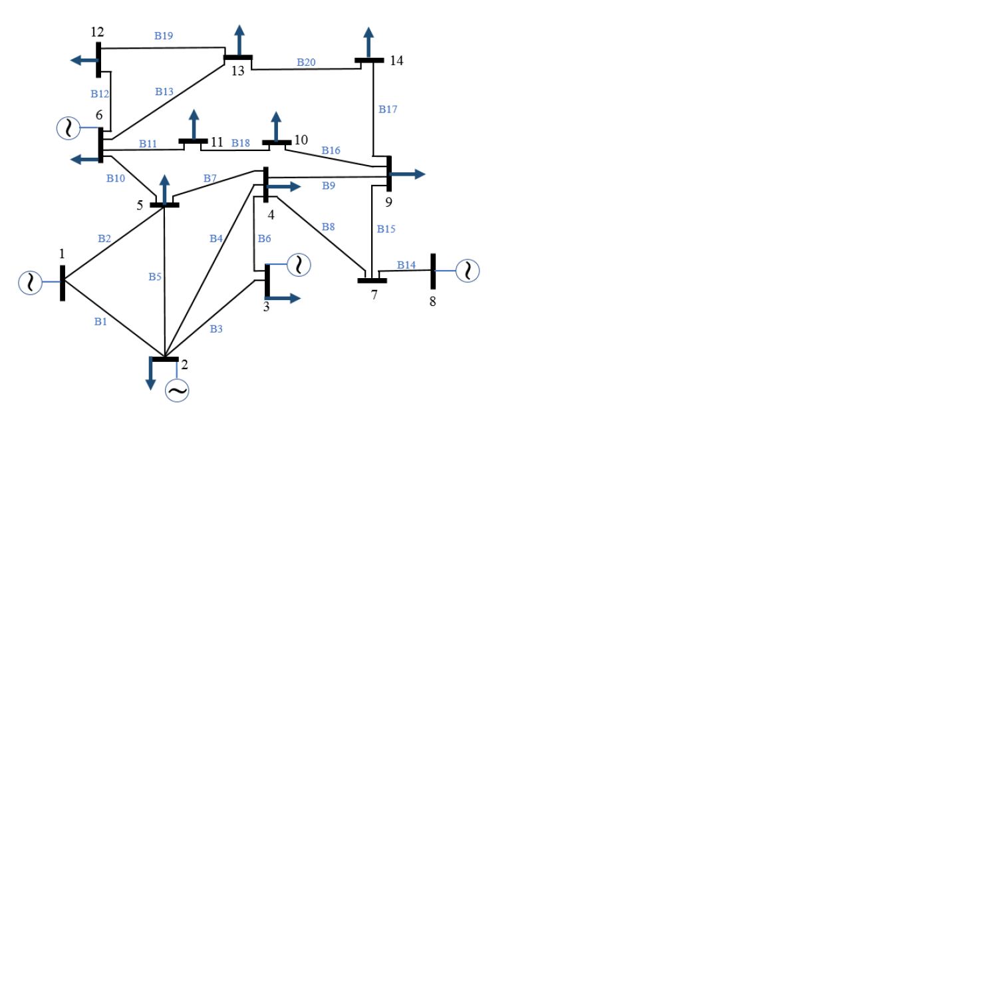

# Minigrid Loadflow Solver

## Dataset Description

[]

The dataset contains a simplified description of an electricity grid, featuring 14 busbars and 20 branches connecting these busbars. Each busbar represents a substation, while each branch represents a powerline connecting substations to transport energy.

- **Branch Information:** Stored in the `adjacency.json` file, providing details like from/to busbars and reactance values.
- **Power Injection Data:** In the `injections.npy` file, representing injected power in MW for each busbar at different timesteps.
- **Target Data:** The `loads.npy` file holds target values, representing the current on each branch at different timesteps.

## First Task

### Components

1. **config.yaml:**
   User-configurable file where the path to training and evaluation files can be specified, along with other configuration details such as learning rates, batch size, and number of epochs.

2. **helper_functions.py:**
   Includes functions (`create_electrical_grid_data` and `get_electrical_grid_data`) to convert injections, adjacency data, and loads data into a graph dataset. Defines the `ElectricalGridModel` using GATConv.

3. **train.py:**
   Main script for the first task. Loads data based on paths provided in config files, transforms it into a graph dataset with `get_electrical_grid_data`, trains the `ElectricalGridModel` using MSE Loss, saves model checkpoints, and plots Training Losses and Validation Losses.

4. **eval.py:**
   Loads validation files from paths specified in the config files, transforms data into the required format with `create_electrical_grid_data`, loads the trained model, makes predictions, and saves predictions as `loads.npy`.

## Second Task : Measure the bias of your model and think of ways how you could potentially reduce underestimation at the cost of more overestimation.

#### : Measuring Bias

1. **Calculate Bias:**
   Compute the bias by comparing predicted values to actual values. Positive bias indicates overestimation, while negative bias indicates underestimation.

2. **Analyze Bias Distribution:**
   Examine the distribution of bias values to understand the magnitude and direction of the bias across different branches or nodes in the electrical grid.

#### Strategies to Address Underestimation:

**Penalizing Underestimation:**
Modify the loss function to include a penalty term for underestimation, potentially reducing underestimation at the cost of more overestimation.

1. **bias_estimation.py:**
   Uses the model trained in the first task. Calculates bias as mentioned in the documentation and analyzes the distribution, achieving an overall bias score of -0.1411.

2. **penalizing_underestimation.py:**
   Modifies the loss function to include a penalty term for cases where the model underestimates the target values. Achieves an overall bias score of -0.3120.

The higher negative bias suggests that the penalty has successfully influenced the model to be more cautious about underestimation. The penalty for underestimation has shifted the model's behavior towards reducing underestimation, even if it comes at the cost of potentially having more overestimation.

## Third Task

### Model Adjustment

Busbar 3 has been split into two by the grid operator, requiring structural changes to the model. A new busbar 14 has been added to the grid model. The saved model's architecture is adjusted, involving extending the model to handle the new sub-station. The weights are loaded from the pre-trained model.

1. **config.yaml:**
   User-configurable file where the path to evaluation files is provided.

2. **eval.py:**
   Loads data files from the config file, transforms them into the proper format using `create_electrical_grid_data`. The extended model includes the additional substation. Weights are loaded from the pre-trained model, and predictions are saved to the `loads.npy` file.

